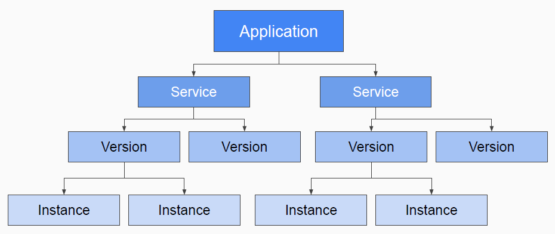
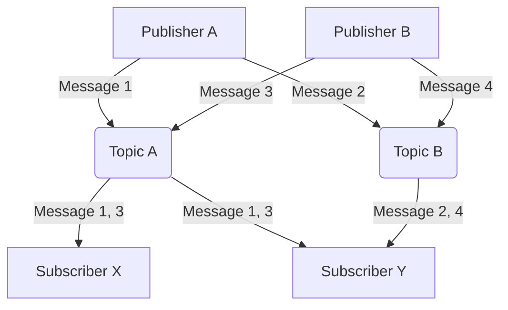
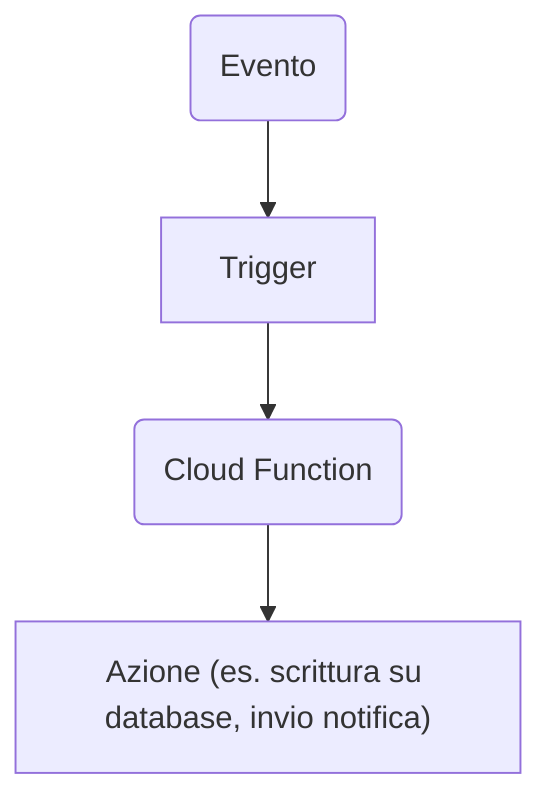

# Google App Engine (GAE) 
<!-- (40 Minuti) -->

**Google App Engine (GAE)** is a **PaaS cloud computing platform** for developing and hosting web applications in Google-managed data centers. GAE abstracts the underlying infrastructure, allowing developers to focus on writing code. It is classified as a **Serverless product**, as it allows developers to write and deploy code without owning a physical server. 

**Key features of GAE:**

* **Multiple language support:** Python, Go, Java, Node.js, and more. **We will focus primarily on Python in this lesson.**
* **No low-level configuration:** Developers do not need to worry about managing networks or virtual machines.
* **API-driven development:** GAE provides APIs for features such as URL fetching, storage (Memcache, Firebase), and application services (MapReduce, Email).
* **Automatic scaling:** App Engine automatically scales the number of instances of your application based on load. Instances are deallocated when usage is low.
* **Service, Version, and Instance Management:** A GAE application is a top-level container that includes services (the logical components of your app), versions (different distributions of a service's code), and instance resources (the computational resources that a version runs on). Services in App Engine generally behave like **microservices**. Versioning allows for testing, rollbacks, and other temporary events.

Under a development perspective, the platform allows to focus mainly on code, without taking care of the underlying OS, network, ...

**Things to consider when developing for GAE:**

* **Resource management strategies** (e.g., database design).
* **Expected performance** (e.g., choosing between Memcache and Datastore).
* **Service configuration parameters** (e.g., pending latencies).
* **Pricing:** GAE offers a **Free tier** (12-month credit or $300) and a **"Always Free" tier** with service-specific limitations (e.g., frontend/backend instance hours, Cloud Storage, egress traffic). **Development and configuration errors can result in significant costs!**.
- **Always free tier limitations**:
    - 28 frontend instance hours per day, 9 backend instance hours per day
    - 5 GB Cloud Storage
    - 1 GB of egress per day
    - Shared memcache
    - 1,000 search operations per day, 10 MB of search indexing
    - 100 email messages per day

## More on Service, Version, Instance Management

As reported before, in GAE application is a top-level container that includes: service, version, instance.

At least one service is required (the default service). Remeber: the default service is not possible to be deleted.

    

    <figcaption>
        <em>Services, versions and instances for GAE applications.</em>
         
         
    </figcaption>

The top-level GAE app can have multiple services, each service can have multiple versions, each version multiple istances. 

Such an organization is proposed to allow developers to split down their projects into smallers pieces (i.e., services) sharing the same App Engine features and that can talk one with the other. 

To this regard, GAE services reseamble microservices, sharing their same role. Each service contains its own code and the corresponding coinfiguration files. 

Versions under the same service allow to access to different version of the same service, to perform tests, rollbacks, or to handle other temporary events. 

Each version holds one or more instances, which are scaled up or down with respect to computing requests. Therefore, when the number of users grow, more instances handling their requests are created; if requests decrease, otherwise. In this way is achieved system *elasticity*.

# Cloud Pub/Sub 
<!-- (30 Minuti) -->

**Cloud Pub/Sub** is an asynchronous messaging service that decouples the services that produce events from the services that process them. It follows the **Publish-Subscribe** pattern, where senders (publishers) send messages to categories (topics) without knowing the specific recipients (subscribers).

In GCP is categorized as an **analysis tool**.

> [!NOTE]
> 
> More information on about the Pub/Sub pattern [here](https://dreams.news/articles/i-design-pattern-parliamo-di-publish-subscribe).

**Cloud Pub/Sub key concepts:**
- **Topic:** A named resource to which publishers send messages.
- **Subscription:** A named resource that represents the flow of messages from a single specific topic to be delivered to the subscribed application.
- **Message:** The combination of data (payload) and attributes (optional metadata) that a publisher sends to a topic and that is ultimately delivered to subscribers.
- **Publisher:** An application that creates and sends messages to a topic.
- **Subscriber:** An application that creates a subscription to a topic to receive messages from it.

*Simplified schema of Pub/Sub*

**How ​​Cloud Pub/Sub works:**

1. A publisher sends a message to a topic.
2. The Pub/Sub service stores messages for active subscriptions.
3. Messages are forwarded from the topic to all its subscriptions.
4. A subscriber receives messages via **pull** (the subscriber queries the service) or **push** (the service sends messages to a subscriber endpoint).
5. The subscriber sends an **acknowledgment (ack)** to the Pub/Sub service for each message received.
6. Acknowledged messages are removed from the subscription queue.

**Cloud Pub/Sub use cases:**

* Workload balancing.
* Asynchronous workflow implementation.
* Event notification distribution.
* Data streaming.

**Cloud Pub/Sub is a tool to extend the capabilities of GCP, connect several modules/functions/application one to another, enable asynchronous event-driven data exchange. It is not a "stand-alone" service directly usable by end users**.

# Google Cloud Functions
<!-- (40 Minutes) -->

**Google Cloud Functions** is Google Cloud's **serverless event-driven compute** platform. The serverless paradigm lets you run code in response to events without having to worry about managing the underlying infrastructure.

**Key features of Cloud Functions:**

* **Fully managed execution environment:** No infrastructure or platforms to provision.
* **Automatic scaling:** Resources are automatically allocated based on events, scaling from a few invocations to millions without any issues.
* **Multiple language support:** Node.js, Python (3.7+), Go.
* **Events and Triggers:** Functions are triggered by **events** (things that happen in your cloud environment) and are associated with **triggers** (declarations of interest in a certain event).

In particular, triggers can be classified into 2 main groups: 

1. HTTP triggers
2. Event triggers
    - Direct triggers
    - Cloud Pub/Sub triggers
    - Cloud Firestore triggers (on database updates)

**Supported event types:**

* **HTTP:** The function is invoked via an HTTP request (can be used to create APIs).
* **Cloud Storage:** The function is triggered by changes to Cloud Storage buckets (for example, file uploads).
* **Cloud Pub/Sub:** The function is triggered by posting messages to a Pub/Sub topic.
* **Cloud Firestore:** The function is triggered by changes to Firestore documents.
* **Firebase:** Events from Firebase services.

*Cloud Functions Schema (Custom Schema)*

## Cloud Functions Caveats
When an event triggers the execution of a Cloud Function, data associated to that event are passed to the function as parameters. 
A *trigger* is a declaration of interest to certain events or a set of events. Associating a function to a trigger allows the function to capture events it is interested in.

The binding is done through commnad-line, UI or Cloud Functions API deployment. 

Events are delivered at least once. Spurious duplicates can occur! But ... *What does it mean?*

**1. "Delivered at least once":**
- Google guarantees that every event is delivered at least once to the Cloud Function.
- This means that the event will not be lost, even if there are temporary problems (such as network errors or function crashes).
- Reliable, but...

**2. "Spurious duplicates can occur":**
- There may be duplicates of the same event, even if it has already been delivered and processed once.
- There can be many reasons: automatic retries in case of timeouts or errors, confirmations not received, etc.
- You must handle duplicates in your function code.

**What this means for you as a developer:**
- You must design your Cloud Functions to be ***idempotent***:
    - Idempotent means that if you perform the same operation multiple times with the same input, the final effect will be the same as if you had performed it only once.
    - Example: updating a record with the same value instead of always adding a new record.

**Concrete example:** Suppose a developer wants to design a function that saves an order to a database when it receives an event.

- Without protections, if the message arrives twice:
    - The function saves two identical orders → ❌ error.

- Solution:
    - The function checks if the order has already been saved (e.g. with a unique ID) before inserting it.
    - So, even if you receive duplicates, you have no side effects → ✅ Good behavior.

## Cloud Functions Use Cases
**Cloud Functions use cases:**

- Real-time file processing, e.g., image resizing: before uploading of an image to a cloud service, it is resized, manipulated, thumbsnails are generated, and so on
- Task automation, e.g., order dispatch: the order request is managed by a function, which extracts the data and sends the result to the correct destination
- Backend for web and mobile applications, e.g. building RESTful APIs: serverless functions can act as a routing layer for API request governing the access logic to DBs, glueing together the front-end to the back-end of a Web application
- Cloud service integration

In general most of the times uploaded artifacts are coded a **single-purpose functions** that are attached to events received by it.
The advantage stands in the fully managed environment, with automatic scaling of the function with respect the trafic, offering a complete ***system elasticity***.

The main use case consists in a layer of logic allowing developers to connect several cloud services, **binding events triggering the execution of a function**. In other words, Cloud Functions act as a **glue** between different distributed pieces of code.

**Cloud Functions Pricing:**
Costs for Cloud Functions have several drivers. They depend on:
- the duration of the function execution, 
- the number of invocations, 
- resources allocated, 
- outgoing network traffic. 

A **free tier** is available with limits on invocations, compute time, and network traffic: 
- Invocations: 2 milions invocations per month
- Computing time: 400.000 GB-seconds per month, 200.000 Ghz-seconds per month
- Networking: 5GB outbound data per month, unlimited inbound, unlimited outbound data to Google APIs in the same origin.
