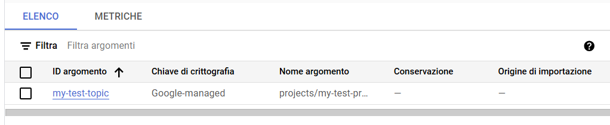
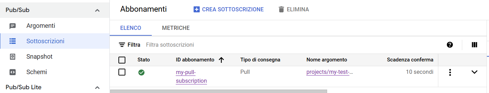
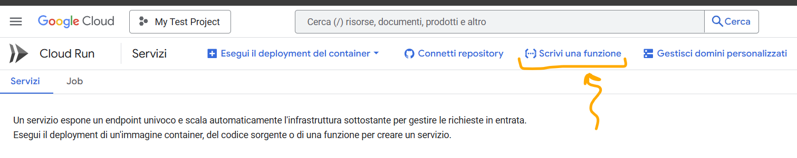
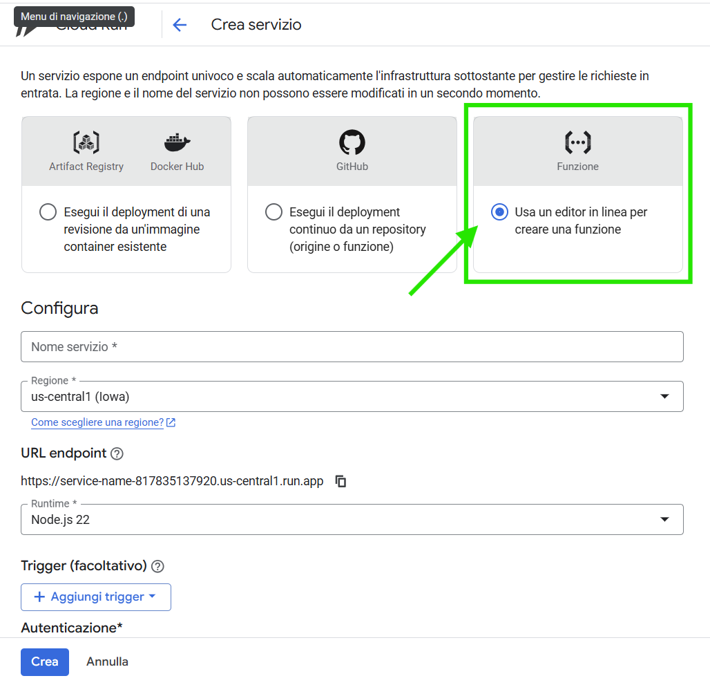

## GCP Lab 
<!-- (circa 2 Ore) -->

## Prerequisites

The main prerequisite is to install the Google Cloud SDK to have the ability to interact with your cloud instances locally via command line. 

To do it, navigate to [install Cloud SDK on your pc](https://cloud.google.com/sdk?hl=it), then click on `Install Google Cloud CLI`.
After the installation, you will have the possibility to interact with GCP from the terminal.

During the installation, will be asked if you want to install Python contextually. If you do not have Python already installed, accept it, otherwise, deselect the option. For more information about performing the installation without Python, look at the [google topic startup](https://cloud.google.com/sdk/gcloud/reference/topic/startup?authuser=2) page. 

> [!NOTE]
>
> Generally speaking, GCloud CLI has the abilty to find your local Python installation in scenarios where you had Python already installed and you unchecked the "install Python" option. Btw, sometimes it fails: in these cases, look at `google topic startup`.

After the installation, you will need to authenticate. To do it, on a terminal (on Windows: ***use the command-prompt, not PowerShell!***), type `gcloud init`. It will route you on the internet to perform the access to your GCP platform. 

> [!NOTE]
>
> If you are working on VSCode (suggested), you can add the official plugin [Google Cloud Code](https://cloud.google.com/code?hl=it).
> 
>It will contextually install the Gemini plugin (*very annoying*), but you can easily disable or just ... *ignore it*.


## Development and Deployment of a Web Application with Flask on Google App Engine
<!-- (75 Minuti) -->

In this section, we will create a simple web application in Python using the Flask framework and use it on Google App Engine.

**Prerequisites:**

- Have a working Python 3 environment.
- Have a verified Google account with an active free tier profile.
- Have installed and configured the Google Cloud SDK (Software Development Kit) on your computer.

**Step 1: Create a local Flask project**

1.  Create a new directory for your Flask project:
    ```bash
    mkdir my-flask-app
    cd my-flask-app
    ```

2.  Create a virtual environment to manage your project's dependencies:    
    ```bash
    python3 -m venv .venv
    ```

3.  Activate the virtual environment:
    ```bash
    source venv/bin/activate  # Su Linux/macOS
    # venv\Scripts\activate   # Su Windows
    ```

4.  Install Flask as a dependency:
    ```bash
    pip install Flask
    ```

5.  Create a file called `main.py` with the following code (a simple "Hello World" Flask application):
    ```python
    # -*- encoding: utf8 -*-
    from flask import Flask

    app = Flask(__name__)

    @app.route('/', methods=['GET'])
    def hello():
        return 'Hello world'

    if __name__ == '__main__':
        app.run(host='127.0.0.1', port=8080, debug=True)
    ```

6.  Run the application locally to test it:
    ```bash
    python3 main.py
    ```
    Open your browser and go to `http://127.0.0.1:8080/`. You should see the message "Hello world".

**Step 2: Prepare for deployment on Google App Engine**

1. Create a file called `requirements.txt` in the root directory of your project collecting all the dependencies of your project present in your virtual environment. 
To generate it, write in your console:
    ```
    pip freeze > requirements.txt
    ```
2.  Create a file called `app.yaml` in the root directory of your project. This file contains the configuration information that GCP requires to run your application. Add the following content (making sure you are using a supported Python 3 runtime):
    ```yaml
    runtime: python311  # Assicurati di usare una versione supportata
    handlers:
    - url: /.*
      script: auto
    ```
    This tells App Engine to use the Python 3.11 runtime and route all requests to the Flask application (whose entry point is automatically detected).

    > [!NOTE]
    >
    > More info about `app.yaml` and other configuration files [here](https://cloud.google.com/appengine/docs/standard/reference/app-yaml?hl=it&tab=python).

**Step 3: Deployment on Google App Engine**

1. Make sure you have initialized gcloud CLI and selected your GCP project. If you haven't already, follow the instructions here: <https://cloud.google.com/sdk/docs/initializing>. <!-- TODO: Fai sezione per gcloud CLI -->

2.  Create a new gcloud project:
    ```bash
    gcloud projects create [YOUR_PROJECT_ID] --set-as-default
    ```
    Replace `[YOUR_PROJECT_ID]` with a unique project ID.

3.  Make sure the project is set as default:
    ```bash
    gcloud config set project [YOUR_PROJECT_ID]
    ```

4.  Initialize your App Engine application in the desired region:
    ```bash
    gcloud app create --project=[YOUR_PROJECT_ID]
    ```
    Please choose a region (for example, `europe-west`).

5.  Deploy your application:
    ```bash
    gcloud app deploy
    ```
    You may need to enable the Cloud Build API if it is not already enabled. Follow the instructions provided in the console. **Please note that Cloud Build has a free quota, but billing is required!**

6.  Once the deployment is complete, you can view your application online by opening the provided link in the console or using the command:
    ```bash
    gcloud app browse
    ```
    The URL will be similar to `https://[YOUR_PROJECT_ID].REGION_ID.r.appspot.com`.

**Step 4: Cleaning**

If you do not intend to use the application, you can deactivate it to avoid costs:
You can do it through the GCP Web UI: 
1. Navigate to AppEngine > Dashboard
2. Select `Settings`
3. Click on `Deactivate Application` 
4. Follow instructions

> [!NOTE]
>
> You may still be charged for other services in your Google Cloud project, such as stored data. To avoid it, ***eliminate the entire project***.

### Extra 1: add two different handlers

Create a Flask web app with two different handlers: 
1. at the base url (/) the application prints "index page" using an external template (i.e., html, not string template), 
2. at the url (/test) the application shows the message "test page" using the same template.

Enhance the application with css and try to structure as much as possible the code.

### Extra 2: add 404 page handler

Following the same approach as the previous extra exercise, add an handler for the 404 page. 

### Extra 3: deploy on GAE

Now deploy the new version of the app on GAE.


## Interacting with Google Cloud Pub/Sub via CLI 
<!-- (30 Minuti) -->

In this section, we will use the Google Cloud CLI to interact with Cloud Pub/Sub.

**Step 1: Creating a Topic**

- Create a new Pub/Sub topic called `my-test-topic` in your project:
    ```bash
    gcloud pubsub topics create my-test-topic --project=[YOUR_PROJECT_ID]
    ```
- You can verify the creation of the topic via the WebUI



**Step 2: Posting Messages**

-  Post some messages on the newly created topic:
    ```bash
    gcloud pubsub topics publish my-test-topic --message="First test message" --attribute="source=cli" --project=[YOUR_PROJECT_ID]
    gcloud pubsub topics publish my-test-topic --message="Second message" --attribute="type=notification" --project=[YOUR_PROJECT_ID]
    ```

**Step 3: Creating a Subscription (Pull)**

-  Create a pull subscription called `my-pull-subscription` to the topic `my-test-topic`:
    ```bash
    gcloud pubsub subscriptions create my-pull-subscription --topic=my-test-topic --project=[YOUR_PROJECT_ID]
    ```
- You can verify the subscription via the WebUI


**Step 4: Pull Messages**

- Retrieve messages from subscription:
    ```bash
    gcloud pubsub subscriptions pull projects/[YOUR_PROHECT_ID]/subscriptions/my-pull-subscription --auto-ack --project=[YOUR_PROJECT_ID]
    ```
    The `--auto-ack` flag indicates that received messages should be automatically acknowledged, ***removing them from the queue***.

- You can view messages also from the WebUI.
Go under: 
    - `arguments > messages`, 
    - select the subscription from the 2nd step drop-down list pull (without ack) 
    - check messages

**Step 5: Cleaning**

- Delete the subscription and topic (if you no longer need it):
    ```bash
    gcloud pubsub subscriptions delete my-pull-subscription --project=[YOUR_PROJECT_ID]
    gcloud pubsub topics delete my-test-topic --project=[YOUR_PROJECT_ID]
    ```
    You can check the effective deletion of the project also via the WebUI.


## Deployment and Test of a Google Cloud Function (HTTP Trigger) 
<!-- (15 Minuti) -->

In this section, we will create a simple HTTP-triggered Cloud Function.

**Step 1: Creating the Function Code**

1. Create a new directory called `hello-function` (or `gcf-flask-app`).
2. Inside this directory, create a file called `main.py` with the following code:
    ```python
    def hello_http(request):
        """
        HTTP Cloud Function.
        """
        request_json = request.get_json(silent=True)
        request_args = request.args

        if request_json and 'name' in request_json:
            name = request_json['name']
        elif request_args and 'name' in request_args:
            name = request_args['name']
        else:
            name = 'World'
        return f'Hello {escape(name)}!'
    ```
3. (*optional*) Eventually create a file called `requirements.txt` in the same directory. It will report your functions dependencies. Assuming, for example, your function depends on `Flask`, The content of the file will be:
    ```
    Flask==3.1.0
    blinker==1.9.0
    click==8.1.8
    colorama==0.4.6
    itsdangerous==2.2.0
    Jinja2==3.1.6
    MarkupSafe==3.0.2
    Werkzeug==3.1.3
    ```

**Step 2: Deployment of the Cloud Function**

1. Make sure you are in the `hello-function` directory in your terminal.

2. Deploy the Cloud Function called `hello-world-function` with HTTP triggers and Python 3.11 runtime (or a supported version).

    To check the version of Python you have, write on the console:
    ```bash
    python --version
    ```
    The result will be something like: 
     ```bash
    Python 3.12.4
    ```
    
    Then, deploy the function with the following command:
    ```bash
    gcloud functions deploy hello-world-function --runtime python311 --trigger-http --allow-unauthenticated --project=[YOUR_PROJECT_ID]
    ```
    The `--allow-unauthenticated` option makes the function accessible without authentication for ease of testing. **In production, it is recommended to implement authentication.**.

**Step 3: Test of the Cloud Function**

1.  Once the deployment is complete, you will get the URL of the function. You can also retrieve it with the command:
    ```bash
    gcloud functions describe hello-world-function --format='value(httpsTrigger.url)' --project=[YOUR_PROJECT_ID]
    ```

2.  Send an HTTP GET request to the obtained URL. You can use your browser or a tool like `curl`:
    ```bash
    curl [YOUR_FUNCTION_URL]
    ```
    You should receive the response "Hello World!".

3.  You can also pass a `name` parameter via the query string:
    ```bash
    curl "[YOUR_FUNCTION_URL]?name=YourName"
    ```
    The response should be "Hello YourName!".

4.  Or, you can send a POST request with a JSON payload:
    ```bash
    curl -X POST "[YOUR_FUNCTION_URL]" -H "Content-Type:application/json" -d '{"name":"GCP User"}'
    ```
    The response should be "Hello GCP User!".

    > [!NOTE]
    >
    > It is possible to do the same tests with a specialized software, such as Postman.

**Step 4: Cleaning**

If you no longer need the Cloud Function, you can delete it:
```bash
gcloud functions delete hello-world-function --project=[YOUR_PROJECT_ID]
```

Is possible to delete the function also from the WebUI.

**Extra: Creation from UI**

It is also possible to create the function from the Web UI:
1. Open the page reporting all the products 
2. Go to the Serverless section
3. Click on "Cloud Run Functions"
4. Follow the images





At this page, you can visually specify the details of your function.

## Conclusions 
<!-- (5 Minuti) -->

In this section we’ve explored the fundamental concepts and put some of the key features into practice, such as developing and deploying web applications with App Engine and interacting with Cloud Pub/Sub and Cloud Functions.

This is just the beginning of your GCP journey. There are many more services and features to explore. We encourage you to continue experimenting and learning to unlock the full potential of Google Cloud Platform.

**Useful resources:**

*   Google Cloud official documentation: <https://cloud.google.com/docs>
*   Google App Engine documentation: <https://cloud.google.com/appengine/docs>
*   Cloud Pub/Sub documentation: <https://cloud.google.com/pubsub/docs/>
*   Cloud Functions documentation: <https://cloud.google.com/functions/docs>
*   GCP Free Tier documentation: <https://cloud.google.com/free/docs/gcp-free-tier>