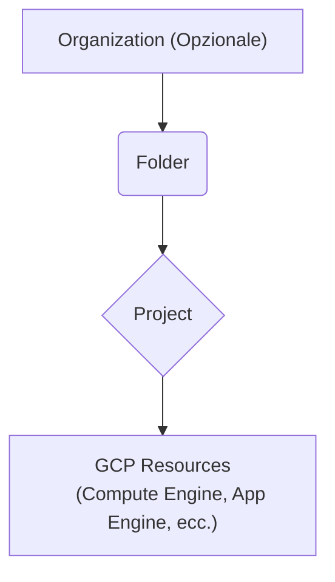
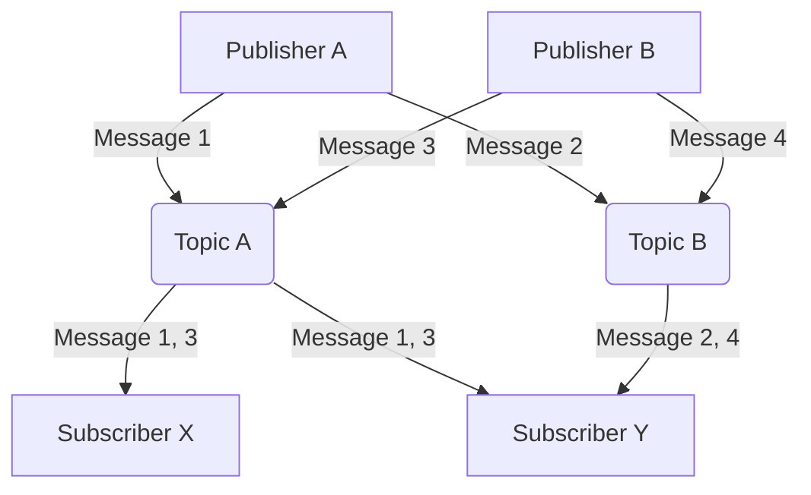
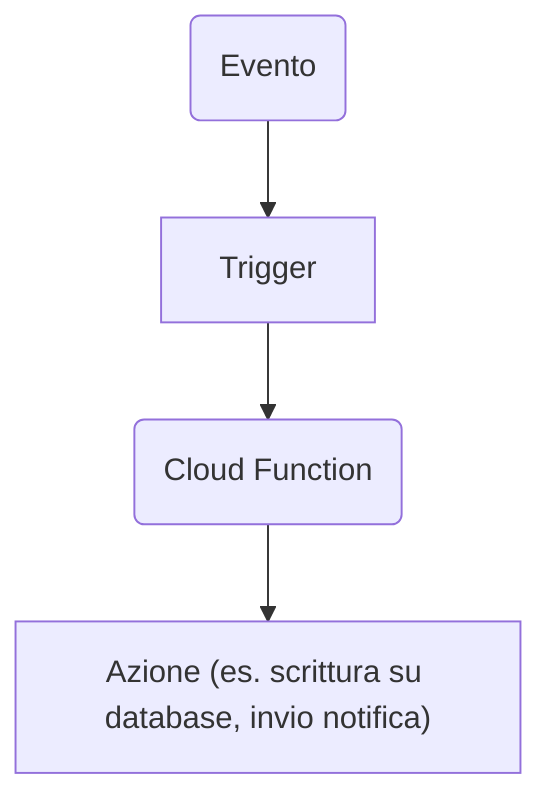

# Introduction to Google Cloud Platform
<!-- (20 Minuti) -->

Google Cloud Platform (GCP) is a suite of cloud computing services that run on the same infrastructure that Google uses internally for its consumer products like **Google Search**, **Gmail**, and **YouTube**. 
This means that the power and reliability that Google services rely on are now available for your projects.

GCP offers several **cloud computing service models** to meet various needs:

- **Infrastructure as a Service (IaaS):** Provides basic computing resources, such as virtual machines, storage, and networking, while leaving the user in control of the operating system and applications.
- **Platform as a Service (PaaS):** Provides a complete environment for developing, running, and managing applications, without the complexity of managing the underlying infrastructure. **We will focus primarily on PaaS in this lab, with the introduction of a SaaS service later**. <!-- TODO: verifica -->
- **Software as a Service (SaaS):** Provides ready-to-use software applications, hosted and managed by the cloud provider.

<!-- TODO: arricchisci associando servizi di esempio di GCP al modello -->

GCP guarantees:

- **Scalability:** Applications can automatically scale based on demand.
- **Reliability:** Google's global infrastructure ensures high availability.
- **Flexibility:** Wide range of services for different needs.

## GCP Fundamental Concepts
<!-- (30 Minuti) -->

To get started working with GCP, it is essential to understand some key concepts:

* **Projects:** All GCP resources are organized into projects. A project isolates your resources, sets up billing, and manages entitlements.
* **Regions and Zones:** GCP resources are distributed into geographic regions (for example, *europe-west* or *us-central*), and within each region there are multiple Availability Zones (data centers). Choosing the right region is important for latency and regulatory compliance.
* **Billing and Free Tier:** To use GCP, you need a verified account that requires a credit card. However, GCP does offer a **free tier** that includes an initial credit (for example, $300 for 12 months) and products with a **"always free" tier** with specific usage limits. **It is critical to monitor your usage to avoid unwanted charges!**.
* **GCP Resource Hierarchy:** GCP resources are organized hierarchically within a project. This includes organizations (for companies), folders, and projects.
* **Identity and Access Management (IAM):** IAM lets you manage who has access to what resources within your project. Permissions are grouped into **roles** (primitive, default, custom) that are assigned to users, groups, or **service accounts**. Service accounts are non-human identities used by applications to authenticate and interact with GCP services.

<!-- TODO: trasforma in tabella per migliore leggibilità -->

*GCP Resource Hierarchy Schema*

<!-- TODO: Verifica lo schema ed approfondisci -->

## Google App Engine (GAE) 
<!-- (40 Minuti) -->

**Google App Engine (GAE)** is a **PaaS cloud computing platform** for developing and hosting web applications in Google-managed data centers. GAE abstracts the underlying infrastructure, allowing developers to focus on writing code.

**Key features of GAE:**

* **Multiple language support:** Python, Go, Java, Node.js, and more. **We will focus primarily on Python in this lesson.**
* **No low-level configuration:** Developers do not need to worry about managing networks or virtual machines.
* **API-driven development:** GAE provides APIs for features such as URL fetching, storage (Memcache, Firebase), and application services (MapReduce, Email).
* **Automatic scaling:** App Engine automatically scales the number of instances of your application based on load. Instances are deallocated when usage is low.
* **Service, Version, and Instance Management:** A GAE application is a top-level container that includes services (the logical components of your app), versions (different distributions of a service's code), and instance resources (the computational resources that a version runs on). Services in App Engine generally behave like **microservices**. Versioning allows for testing, rollbacks, and other temporary events.

**Things to consider when developing for GAE:**

* **Resource management strategies** (e.g., database design).
* **Expected performance** (e.g., choosing between Memcache and Datastore).
* **Service configuration parameters** (e.g., pending latencies).
* **Pricing:** GAE offers a **Free tier** (12-month credit or $300) and a **"Always Free" tier** with service-specific limitations (e.g., frontend/backend instance hours, Cloud Storage, egress traffic). **Development and configuration errors can result in significant costs!**.

<!-- TODO: Approfondisci -->

## Cloud Pub/Sub 
<!-- (30 Minuti) -->

**Cloud Pub/Sub** is an asynchronous messaging service that decouples the services that produce events from the services that process them. It follows the **Publish-Subscribe** pattern, where senders (publishers) send messages to categories (topics) without knowing the specific recipients (subscribers).
**Concetti chiave di Cloud Pub/Sub:**

> [!NOTE]
> 
> More information on about the Pub/Sub pattern [here](https://dreams.news/articles/i-design-pattern-parliamo-di-publish-subscribe).

- **Topic:** A named resource to which publishers send messages.
- **Subscription:** A named resource that represents the flow of messages from a single specific topic to be delivered to the subscribed application.
- **Message:** The combination of data (payload) and attributes (optional metadata) that a publisher sends to a topic and that is ultimately delivered to subscribers.
- **Publisher:** An application that creates and sends messages to a topic.
- **Subscriber:** An application that creates a subscription to a topic to receive messages from it.

*Simplified schema of Pub/Sub*

**How ​​Cloud Pub/Sub works:**

1. A publisher sends a message to a topic.
2. The Pub/Sub service stores messages for active subscriptions.
3. Messages are forwarded from the topic to all its subscriptions.
4. A subscriber receives messages via **pull** (the subscriber queries the service) or **push** (the service sends messages to a subscriber endpoint).
5. The subscriber sends an **acknowledgment (ack)** to the Pub/Sub service for each message received.
6. Acknowledged messages are removed from the subscription queue.

**Cloud Pub/Sub use cases:**

* Workload balancing.
* Asynchronous workflow implementation.
* Event notification distribution.
* Data streaming.

**Cloud Pub/Sub is a tool to extend the capabilities of GCP, connect several modules/functions/application one to another, enable asynchronous event-driven data exchange. It is not a "stand-alone" service directly usable by end users**.

## Google Cloud Functions
<!-- (40 Minutes) -->

**Google Cloud Functions** is Google Cloud's **serverless event-driven compute** platform. The serverless paradigm lets you run code in response to events without having to worry about managing the underlying infrastructure.

**Key features of Cloud Functions:**

* **Fully managed execution environment:** No infrastructure or platforms to provision.
* **Automatic scaling:** Resources are automatically allocated based on events, scaling from a few invocations to millions without any issues.
* **Multiple language support:** Node.js, Python (3.7+), Go.
* **Events and Triggers:** Functions are triggered by **events** (things that happen in your cloud environment) and are associated with **triggers** (declarations of interest in a certain event).

**Supported event types:**

* **HTTP:** The function is invoked via an HTTP request (can be used to create APIs).
* **Cloud Storage:** The function is triggered by changes to Cloud Storage buckets (for example, file uploads).
* **Cloud Pub/Sub:** The function is triggered by posting messages to a Pub/Sub topic.
* **Cloud Firestore:** The function is triggered by changes to Firestore documents.
* **Firebase:** Events from Firebase services.

*Cloud Functions Schema (Custom Schema)*

**Cloud Functions Pricing:** Costs depend on the duration of the function execution, the number of invocations, resources allocated, and outgoing network traffic. A **free tier** is available with limits on invocations, compute time, and network traffic.

**Cloud Functions use cases:**

- Real-time file processing (e.g., image resizing).
- Task automation (e.g., order dispatch).
- Backend for web and mobile applications (building RESTful APIs).
- Cloud service integration.