# Introduction to Google Cloud Platform
<!-- (20 Minuti) -->

Google Cloud Platform (GCP) is a suite of cloud computing services that run on the same infrastructure that Google uses internally for its consumer products like **Google Search**, **Gmail**, and **YouTube**. 
This means that the power and reliability that Google services rely on are now available for your projects.

GCP offers several **cloud computing service models** to meet various needs:

- **Infrastructure as a Service (IaaS):** Provides basic computing resources, such as virtual machines, storage, and networking, while leaving the user in control of the operating system and applications.
- **Platform as a Service (PaaS):** Provides a complete environment for developing, running, and managing applications, without the complexity of managing the underlying infrastructure. **We will focus primarily on PaaS in this lab, with the introduction of a SaaS service later**. <!-- TODO: verifica -->
- **Software as a Service (SaaS):** Provides ready-to-use software applications, hosted and managed by the cloud provider.

<!-- TODO: arricchisci associando servizi di esempio di GCP al modello -->

GCP guarantees:

- **Scalability:** Applications can automatically scale based on demand.
- **Reliability:** Google's global infrastructure ensures high availability.
- **Flexibility:** Wide range of services for different needs.

## GCP Fundamental Concepts
<!-- (30 Minuti) -->

To get started working with GCP, it is essential to understand some key concepts:

* **Projects:** All GCP resources are organized into projects. A project isolates your resources, sets up billing, and manages entitlements.
* **Regions and Zones:** GCP resources are distributed into geographic regions (for example, *europe-west* or *us-central*), and within each region there are multiple Availability Zones (data centers). Choosing the right region is important for latency and regulatory compliance.
* **Billing and Free Tier:** To use GCP, you need a verified account that requires a credit card. However, GCP does offer a **free tier** that includes an initial credit (for example, $300 for 12 months) and products with a **"always free" tier** with specific usage limits. **It is critical to monitor your usage to avoid unwanted charges!**.
* **GCP Resource Hierarchy:** GCP resources are organized hierarchically within a project. This includes organizations (for companies), folders, and projects.
* **Identity and Access Management (IAM):** IAM lets you manage who has access to what resources within your project. Permissions are grouped into **roles** (primitive, default, custom) that are assigned to users, groups, or **service accounts**. Service accounts are non-human identities used by applications to authenticate and interact with GCP services.

<!-- TODO: trasforma in tabella per migliore leggibilità -->

*GCP Resource Hierarchy Schema*

## GCP Billing 
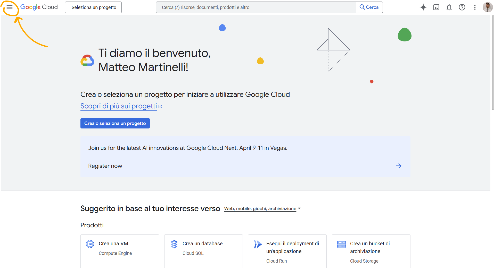
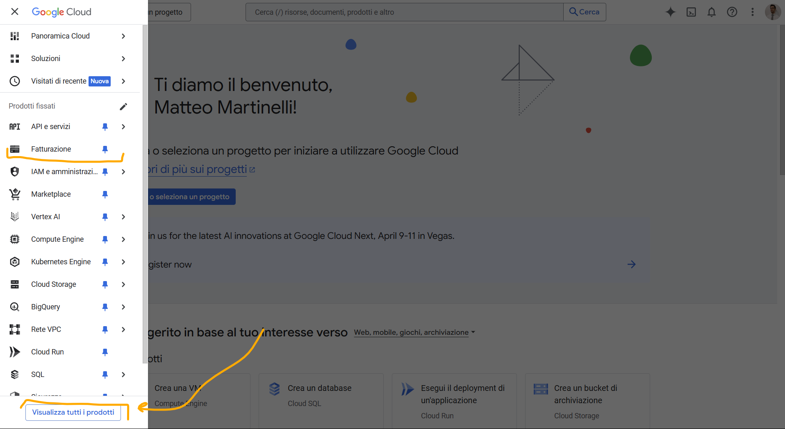
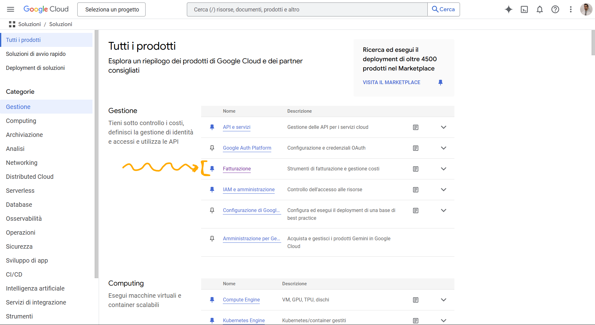
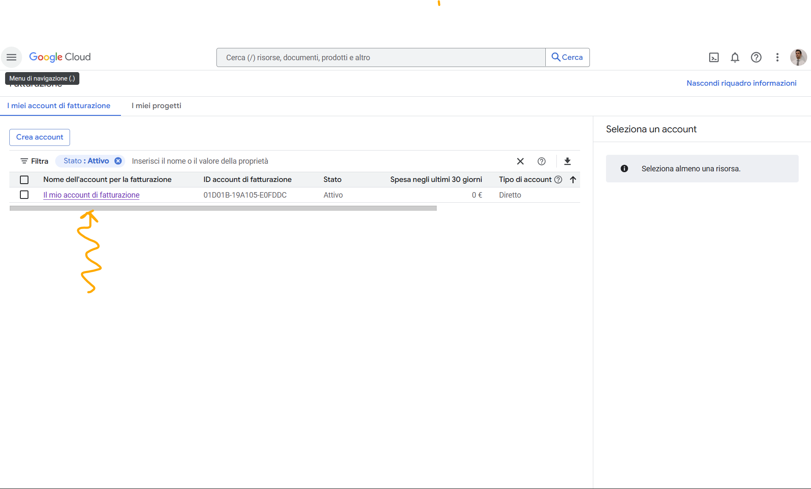
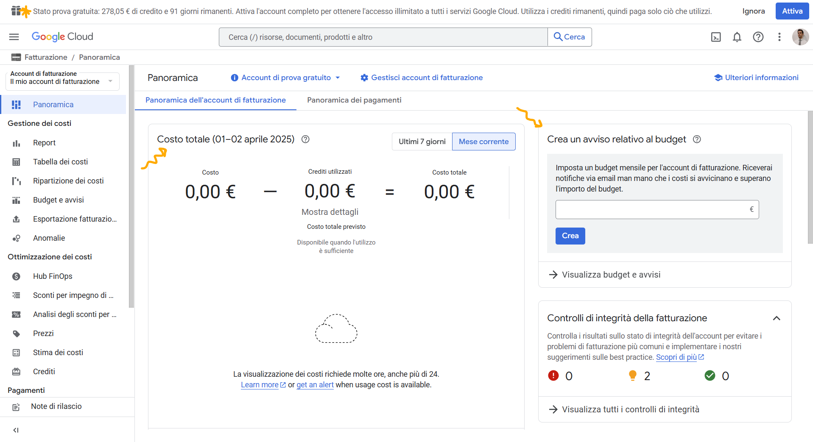

> [!NOTE]
>
> Do not active the billing complete account! 

During the test period, you have around 300 Euros of credits to test the platform. 

At the start, the billing account is limited, i.e., some functionalities are limited, such as the maximum number of projets you can create (a total of 10). 

Limits are, by the way, useful during the learning phase, as Google will not automatically charge you during your free trial. 

If you do not want to pay after the trial ends, you don't have to do anything: your account will simply be frozen until you activate full billing.

After the actiation of the account, you will need to keep under control costs and budgets. In [this video](https://www.youtube.com/watch?v=KiTg8RPpGG4) are reported main tools you can use to keep bills under control.

## GCP Resource Hierarchy and Projects

In GCP, all services are associated with a project. Through a project, you can track resorce usage, enable billing, manage permissions and credentials, enable services and APIs ...

To create a new project: 

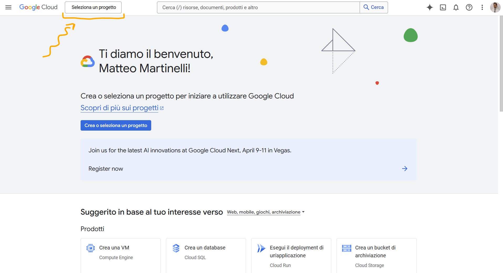
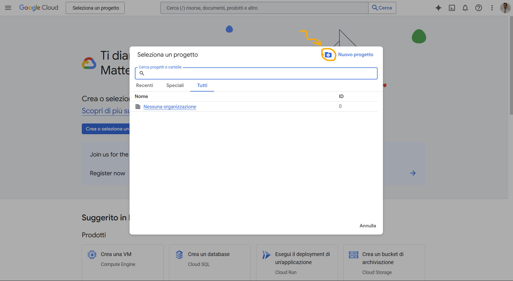
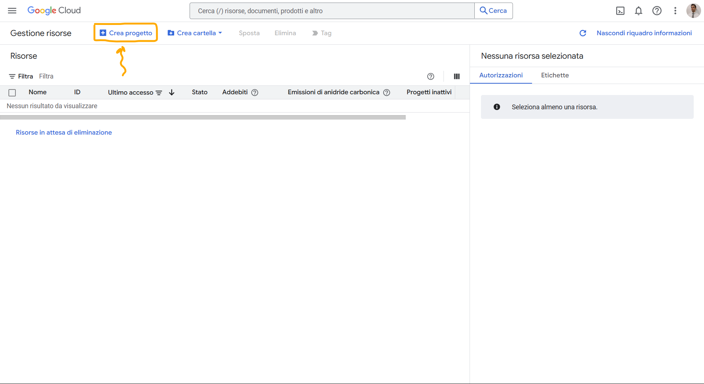
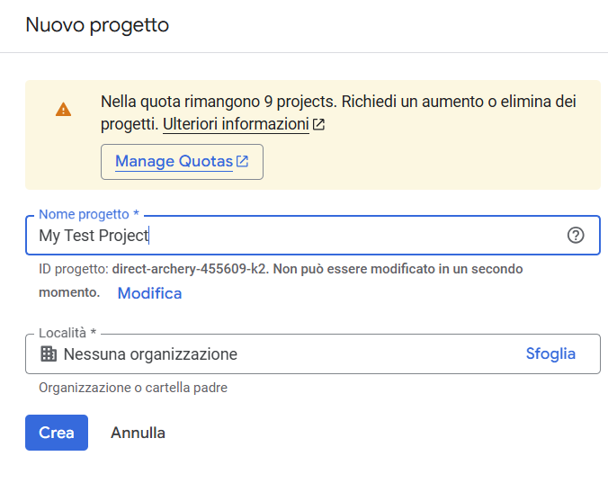
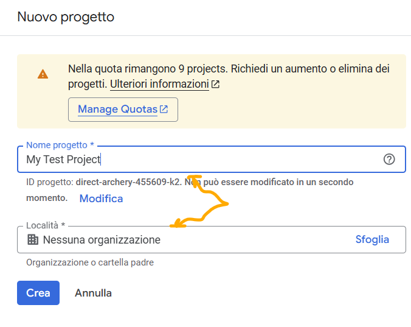

Usually, projects belongs to organizations, and you can have one or many.

> [!NOTE]
>
> Consider that GCP bounds organizations to ***their domains***, e.g. `organization.org`.
> 
> Is by the way possible to create projects not associated to any organization.

After the creation of the organization or a project, you can add other users or members through Google Workspace or Cloud Identity. 

## GCP IAM and Service Accounts

In GCP there are 2 main type of accounts: *user accounts* and *service accounts*. 

The former apply to humans, the latter to services, machines and aplications. 

### User Accounts

The IAM - Identity Access Management section, allows you to assign roles and capabilities to users. Roles and capabilities can be associated to projects or organizations. 

They are many, and define ***who*** - ***can do what*** - ***on which resource***. 

It happens quiet often to need more than one permission to complete assigned operations. To make it easier to assign roles, they are grouped into 3 different categories: 
1. *primitive*
2. *predefined*
3. *custom*

Associated documentation [here](https://cloud.google.com/iam/docs/roles-overview?hl=it&authuser=2).

Main roles are: 
- Owner
    - Add and remove members
    - Delete Projects
    - Editor and Viewer capabilities
- Editor
    - Deploy applications
    - Modify code
    - Configure services
    - Viewer capabilities
- Viewer
    - Read-only access
- Billing administrator
    - Manage billing
    - Add and remove administrators

Predefined roles apply to individual resources. 

Custom roles are defined by the user as a collection of allowed operations. 

### Service Accounts

Service Accounts are special accounts used by applications or services to authenticate and interact with Google Cloud APIs. 

They are designed for systems, machines, and automated processes.
Service accounts can be used for: 
- Accessing a DB
- Write on a Cloud Storage
- Invoke Cloud Functions
- Interact with other GCP APIs securely using cryptographic keys instead of passwords

They are identified by an email address, such as `compute@developer.gserviceaccount.com`.

Is possible to assign predefined or custom IAM roles to service accounts. 

> [!NOTE]
>
> Service accounts are also resources. 

To create a Service Account: 
1. Go to IAM & Admin > Service Accounts
2. Click "Create Service Account"
3. Assign a name and description
4. Set IAM roles for required permissions
5. Download the credentials JSON file (for app authentication)

To use the service account, than you can:
1. Use the generated JSON file
    - Download it and set it as an environment variable 
2. Use Workload Identity (more secure)
    - assign a Service Account to a service (e.g. Cloud Run or Kubernetes) so that it uses credentials without external files

## How to Interact with GCP

There are 4 main ways to interact with GCP: 
1. Through GCP Console (Web UI)
2. Through Cloud Shell and Cloud SDK (a temporary VM with Cloud SDK pre-installed and command-line interface)
3. Using the Cloud Console Mobile app
4. Using the REST-based APIs

### Cloud Shell

It is a Debian-based Linux terminal, accessible directly from Google Cloud Console.
It already has the Cloud SDK, gcloud CLI, kubectl, terraform, Python, and other tools installed.

It includes 5 GB of persistent storage for your files.
It does not require installation as is available throgh the Web UI, perfect for quick testing.

To use it, click on the terminal icon in the top left of the GCP landing page. 

Read pop-ups, activate the machine, and then explore the shell. 

Through the shell, read the file `README-cloudshell.txt`.

### Cloud SDK

It is a set of tools that you install on your PC to manage GCP via the command line.
It includes gcloud (main CLI), gsutil (for Cloud Storage), and bq (for BigQuery).

It allows you to manage GCP resources without using Cloud Shell. To install it, visit the page of the [documentation](https://cloud.google.com/sdk/docs/install?hl=it).

For more information, explore the associated [docs](https://cloud.google.com/sdk?hl=it).

### Cloud Shell vs. Cloud SDK

| Tool      | Cloud Shell | Cloud SDK |
| --------- | ----------- | --------- |
| **Usage** | For rapid tests, management via browser, no installation | To manage GCP from your pc or automate with scripts |
<!-- TODO: Refine the table -->

## GCP Services Overview

They are MANY. 
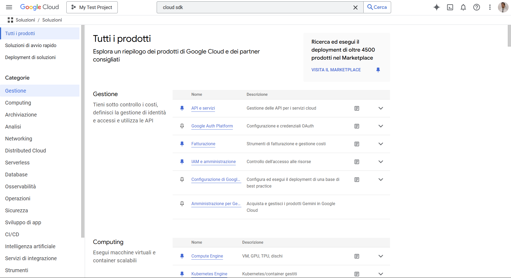

Main categories are:

| <!--      --> | <!--     --> | <!--                 --> | <!--       --> | <!--      --> | <!--             --> |
| ------------- | ------------ | ------------------------ | -------------- | ------------- | -------------------- |
| 1. Management | 2. Computing | 3. Archiving             | 4. Analysis    | 5. Networking | 6. Distributed Cloud |
| 7. Serverless | 8. Database  | 9. Observability         | 10. Operations | 11. Security  | 12. App Development  |
| 13. CI/CD     | 14. AI       | 15. Integration Services | 16. Tools      | 17. Web3      | 18. Other            |

More in detail: ...

---

<!-- TODO: organize in a table -->
### **1. Computing**
- **Compute Engine** → Scalable virtual machines.
- **App Engine** → PaaS for running applications without managing infrastructure.
- **Cloud Run** → Serverless container execution.
- **Google Kubernetes Engine (GKE)** → Managed Kubernetes for container orchestration.
- **Cloud Functions** → Serverless functions to run code in response to events.
- **Bare Metal Solution** → Dedicated physical servers for high-performance applications.

---

### **2. Storage & Databases**
- **Cloud Storage** → Scalable and secure object storage.
- **Filestore** → NFS-based file storage.
- **Cloud SQL** → Managed relational database (MySQL, PostgreSQL, SQL Server).
- **Cloud Spanner** → Distributed and scalable relational database.
- **Bigtable** → NoSQL database for large-scale data.
- **Firestore** → NoSQL document-based database for serverless apps.
- **Memorystore** → Managed Redis and Memcached for caching.
- **AlloyDB** → Advanced PostgreSQL database for critical workloads.

---

### **3. Networking**
- **Virtual Private Cloud (VPC)** → Customizable private networks.
- **Cloud Load Balancing** → Global load balancing for HTTP(S) and TCP/UDP traffic.
- **Cloud CDN** → Content delivery network for static assets.
- **Cloud DNS** → Managed and scalable DNS service.
- **Cloud Interconnect** → Dedicated connection between your on-premises network and GCP.
- **Cloud NAT** → Secure internet access for instances without public IPs.

---

### **4. AI & Machine Learning**
- **Vertex AI** → Platform for training and deploying AI models.
- **AI Platform** → Advanced machine learning tools.
- **Cloud AutoML** → Train custom AI models without coding.
- **Speech-to-Text / Text-to-Speech** → APIs for voice conversion.
- **Translation API** → Automatic text translation.
- **Vision AI** → Image analysis with artificial intelligence.

---

### **5. Data Analytics**
- **BigQuery** → Scalable data warehouse for large-scale data analysis.
- **Dataflow** → Real-time data processing with Apache Beam.
- **Dataproc** → Managed Hadoop and Spark for big data.
- **Pub/Sub** → Real-time messaging for event-driven applications.
- **Looker** → Business intelligence and data analytics.

---

### **6. Security & Identity**
- **Identity and Access Management (IAM)** → Control access to GCP services.
- **Secret Manager** → Secure storage for keys and credentials.
- **Cloud Armor** → DDoS protection and firewall for web applications.
- **Security Command Center** → Security threat monitoring.
- **BeyondCorp Enterprise** → Secure access to applications without a VPN.

---

### **7. Developer Tools**
- **Cloud Build** → CI/CD for building and deploying applications.
- **Cloud Source Repositories** → Private Git repositories on GCP.
- **Artifact Registry** → Management of containers and software packages.
- **Cloud Code** → Development plugins for IDEs like VS Code and IntelliJ.

---

### **8. Internet of Things (IoT)**
- **Cloud IoT Core** → Service for connecting and managing IoT devices (deprecated).
- **Edge TPU** → AI acceleration chips for IoT devices.

---

### **9. Hybrid & Multi-cloud**
- **Anthos** → Management of Kubernetes and multi-cloud applications.
- **Cloud Run for Anthos** → Serverless on Kubernetes.
- **Migrate for Compute Engine** → Tool for migrating VMs from on-premises or other cloud providers.

---

### **10. Management & Monitoring**
- **Operations Suite (formerly Stackdriver)** → Monitoring, logging, and diagnostics.
- **Cloud Logging** → Collection and analysis of logs.
- **Cloud Monitoring** → Dashboards and metrics for GCP.
- **Cloud Trace** → Application performance analysis.

---

We will focus on: ***Google App Engine***, ***Google Cloud Functions*** and ***Cloud Pub/Sub***.

## Google App Engine (GAE) 
<!-- (40 Minuti) -->
<!-- TODO: TEST -->

**Google App Engine (GAE)** is a **PaaS cloud computing platform** for developing and hosting web applications in Google-managed data centers. GAE abstracts the underlying infrastructure, allowing developers to focus on writing code.

**Key features of GAE:**

* **Multiple language support:** Python, Go, Java, Node.js, and more. **We will focus primarily on Python in this lesson.**
* **No low-level configuration:** Developers do not need to worry about managing networks or virtual machines.
* **API-driven development:** GAE provides APIs for features such as URL fetching, storage (Memcache, Firebase), and application services (MapReduce, Email).
* **Automatic scaling:** App Engine automatically scales the number of instances of your application based on load. Instances are deallocated when usage is low.
* **Service, Version, and Instance Management:** A GAE application is a top-level container that includes services (the logical components of your app), versions (different distributions of a service's code), and instance resources (the computational resources that a version runs on). Services in App Engine generally behave like **microservices**. Versioning allows for testing, rollbacks, and other temporary events.

**Things to consider when developing for GAE:**

* **Resource management strategies** (e.g., database design).
* **Expected performance** (e.g., choosing between Memcache and Datastore).
* **Service configuration parameters** (e.g., pending latencies).
* **Pricing:** GAE offers a **Free tier** (12-month credit or $300) and a **"Always Free" tier** with service-specific limitations (e.g., frontend/backend instance hours, Cloud Storage, egress traffic). **Development and configuration errors can result in significant costs!**.

<!-- TODO: Approfondisci -->

## Cloud Pub/Sub 
<!-- (30 Minuti) -->
<!-- TODO: TEST -->

**Cloud Pub/Sub** is an asynchronous messaging service that decouples the services that produce events from the services that process them. It follows the **Publish-Subscribe** pattern, where senders (publishers) send messages to categories (topics) without knowing the specific recipients (subscribers).
**Concetti chiave di Cloud Pub/Sub:**

> [!NOTE]
> 
> More information on about the Pub/Sub pattern [here](https://dreams.news/articles/i-design-pattern-parliamo-di-publish-subscribe).

- **Topic:** A named resource to which publishers send messages.
- **Subscription:** A named resource that represents the flow of messages from a single specific topic to be delivered to the subscribed application.
- **Message:** The combination of data (payload) and attributes (optional metadata) that a publisher sends to a topic and that is ultimately delivered to subscribers.
- **Publisher:** An application that creates and sends messages to a topic.
- **Subscriber:** An application that creates a subscription to a topic to receive messages from it.

*Simplified schema of Pub/Sub*

**How ​​Cloud Pub/Sub works:**

1. A publisher sends a message to a topic.
2. The Pub/Sub service stores messages for active subscriptions.
3. Messages are forwarded from the topic to all its subscriptions.
4. A subscriber receives messages via **pull** (the subscriber queries the service) or **push** (the service sends messages to a subscriber endpoint).
5. The subscriber sends an **acknowledgment (ack)** to the Pub/Sub service for each message received.
6. Acknowledged messages are removed from the subscription queue.

**Cloud Pub/Sub use cases:**

* Workload balancing.
* Asynchronous workflow implementation.
* Event notification distribution.
* Data streaming.

**Cloud Pub/Sub is a tool to extend the capabilities of GCP, connect several modules/functions/application one to another, enable asynchronous event-driven data exchange. It is not a "stand-alone" service directly usable by end users**.

## Google Cloud Functions
<!-- (40 Minutes) -->
<!-- TODO: TEST -->

**Google Cloud Functions** is Google Cloud's **serverless event-driven compute** platform. The serverless paradigm lets you run code in response to events without having to worry about managing the underlying infrastructure.

**Key features of Cloud Functions:**

* **Fully managed execution environment:** No infrastructure or platforms to provision.
* **Automatic scaling:** Resources are automatically allocated based on events, scaling from a few invocations to millions without any issues.
* **Multiple language support:** Node.js, Python (3.7+), Go.
* **Events and Triggers:** Functions are triggered by **events** (things that happen in your cloud environment) and are associated with **triggers** (declarations of interest in a certain event).

**Supported event types:**

* **HTTP:** The function is invoked via an HTTP request (can be used to create APIs).
* **Cloud Storage:** The function is triggered by changes to Cloud Storage buckets (for example, file uploads).
* **Cloud Pub/Sub:** The function is triggered by posting messages to a Pub/Sub topic.
* **Cloud Firestore:** The function is triggered by changes to Firestore documents.
* **Firebase:** Events from Firebase services.

*Cloud Functions Schema (Custom Schema)*

**Cloud Functions Pricing:** Costs depend on the duration of the function execution, the number of invocations, resources allocated, and outgoing network traffic. A **free tier** is available with limits on invocations, compute time, and network traffic.

**Cloud Functions use cases:**

- Real-time file processing (e.g., image resizing).
- Task automation (e.g., order dispatch).
- Backend for web and mobile applications (building RESTful APIs).
- Cloud service integration.